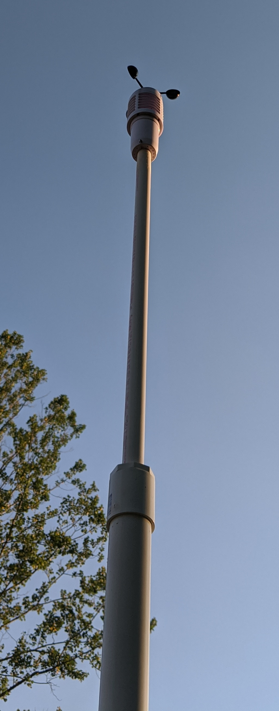

# Adding a DIY weatherstation to Home Assistant

I recently built a remote weatherstation with the core MPU a 8266
running ESPHome. This weatherstation currently pushes the following
measurements into my HomeAssistant system via the HA/ESPHome API.
Basic direction for this weatherstation came from [digiblur](https://www.youtube.com/watch?v=VUqOIPVbeF0).

* Outside temperature using BME280 
* Barometric pressure using BME280
* Outside humidity using BME280
* Outside temperature using SHT31-D
* Outside humidity using SHT31-D
* Hacked La Crosse TX58UN tipping bucket raingauge (ebay purchase)
* Hacked La Crosse LTV-W1 Wind Speed Sensor (ebay purchase)
* UV Index using VEML6075 UV
* Ambient Light using  MAX44009

<table>
  <tr>
  <td> </td>
  <td> </td>
  </tr>
</table>
	
This is a remote unattended weather station. Thus included the following
to allow it to be standalone albeit it does connect into my local wifi.

* Wemo D1 mini pro with exernal antenna
* 18650 batter with P4056 based charging circuit connected to 1.5 watt solar panel.

The [BME280 has known issues with reliably reporting humity reading](https://thecavepearlproject.org/2015/06/15/developing-an-arduino-based-weather-station/). 

	DHT11 and DHT12 is not trusted in general absolutely.
	AHT10 and AHT15 – also not trusted, slow and inaccurate, but maybe better than DHTxx
	AM2320 – relatively not that bad (in compare to DHT and AHT)
	BME280 and BME680 is always higher temperature and lower humidity (I suspect self-heating) I think those sensors are not for uncalibrated DIY projects)
	HDC1080 – wrong (high) humidity
	HDC2080 – wrong (high) temperature
	SHT2x – OK
	SHT3x – OK
	SHTC1 and SHTC3 – OK
	SHT85 – Perfect

This is why the SHT31-D is included. It also provides a double reference for
measuring the temperature. Experience with other commonly using temperature
sensors have proven to be much less accurate e.g. DHT22.

## Weewx

As part of this project, a local [weewx](http://weewx.com/) server was
set up alongside Home Assistant on a UNRAID based server using Docker.

Home Assistant automations were created to forward the weather station
sensor data to MQTT. A simple generic weewx driver was written to 
transfer directly from the MQTT topics into the weewx loop packet.
By using MQTT topic names that come directly from weewx, the driver
is small and simple.

## Unsupported Sensors

At the time of this writing, ESPHome supports neither the *VEML6075* or the *MAX44009*.

### MAX44009
A native ESPHome component was written for the MAX44009 sensor given the [difficulties
people were having](https://github.com/esphome/feature-requests/issues/29) incorporating an external arduino library. This native component has NOT been submitted to ESPHome for merging as it is
incomplete. The code to read and calculate the LUX reading came from [dantudose github](https://github.com/dantudose/MAX44009).

Adding the native code for this sensor under the ESPHome directory was not obvious besides submitting
a pull request to have the component added to ESHome's github. Turns out you can create a directory
under the ESPHome root directory named *custom_components*. Now copy the max44009 directory under
the custom_components directory.

### VEM6075
The VEML6075 was added as a custom component in the *weatherstation.yaml* 
configuration file. This required writing the *UVLightSensor.h* and adding the *includes* and *libraries*
list items in the weatherstation.yaml file.
